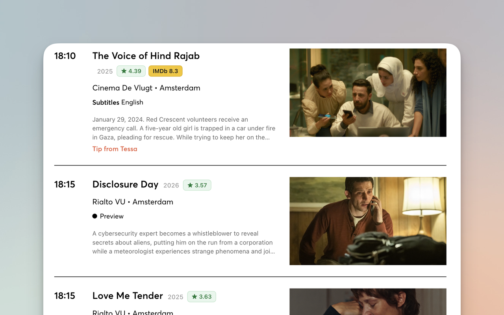

# Cineville Ratings — Letterboxd + IMDb

[](https://chromewebstore.google.com/detail/cineville-ratings/palgcbdjlmmaopmjddbengbieaahoind)
[](https://chromewebstore.google.com/detail/cineville-ratings/palgcbdjlmmaopmjddbengbieaahoind)
[](https://buymeacoffee.com/dpashutskii)

A Chrome (Manifest V3) extension that overlays **Letterboxd** and optional **IMDb**
ratings onto [cineville.nl](https://cineville.nl) — including the
[showtimes](https://cineville.nl/en-GB/showtimes) page, film listings, and film
detail pages.

Each film gets a small badge, e.g. `★ 4.12   IMDb 7.8`, linking to the source pages.



## How it works

- A **content script** runs on `cineville.nl`, finds links to film pages
  (`/films/{slug}`) as they render (cineville's showtimes list is loaded
  client-side, so a `MutationObserver` catches them), and injects a badge.
- The **service worker** does the cross-origin work (content scripts can't, due
  to CORS):
  1. Resolves the canonical **title + year** from cineville's own Next.js data
     endpoint (`/_next/data/{buildId}/{locale}/films/{slug}.json`).
  2. **Finds the exact film.** Letterboxd's `/search/` endpoint is bot-blocked,
     so matching goes by id instead, best matcher first:
     [TMDB](https://www.themoviedb.org/) search → `letterboxd.com/tmdb/{id}/`,
     then OMDb's IMDb id → `letterboxd.com/imdb/{id}/`, then a year-validated
     slug guess. All matches are sanity-checked against the release year.
  3. **Letterboxd rating** is read from the resolved film page's JSON-LD
     (`aggregateRating.ratingValue`, out of 5); the **IMDb rating** comes from
     the [OMDb API](https://www.omdbapi.com/); the **synopsis** (detail pages)
     comes from TMDB's overview or Letterboxd's `og:description`.
  4. Caches results in `chrome.storage.local` (7 days for hits, 1 day for misses)
     to stay fast and avoid hammering the sources.

## Install

**[➜ Install from the Chrome Web Store](https://chromewebstore.google.com/detail/cineville-ratings/palgcbdjlmmaopmjddbengbieaahoind)** — the easy way.

<details>
<summary>Or load it unpacked (for development)</summary>

1. Open `chrome://extensions`.
2. Enable **Developer mode** (top right).
3. Click **Load unpacked** and select this folder.
4. Visit https://cineville.nl/en-GB/showtimes — badges appear under film titles.

</details>

## API keys (open the popup — click the toolbar icon)

Both keys are free, stored only in your browser, and never committed to this repo.
A basic Letterboxd match works without any key, but the keys make it far more
reliable.

- **TMDB (recommended)** — greatly improves matching for foreign/festival films
  and supplies synopses. Get a v3 "API Key" at
  https://www.themoviedb.org/settings/api (instant, no email step).
- **OMDb (for IMDb ratings)** — get a free key at
  https://www.omdbapi.com/apikey.aspx (1,000 req/day) and **click the activation
  link in the email**. Then tick **Show IMDb ratings**.

Paste the keys in the popup and click **Save** (then **Clear cache** + reload the
tab to refresh existing results).

## Limitations & notes

- **Matching** uses the cineville title + release year and is validated against
  the release year to avoid same-named films. Titles in neither TMDB nor IMDb
  will show the year only, with no rating.
- **Letterboxd has no public API** for this use case, so ratings are scraped from
  public pages. This is against Letterboxd's ToS, so this extension is intended for
  personal use and is **not** suitable for the Chrome Web Store as-is.
- Rendering depends on cineville's HTML structure; a site redesign may require
  selector/endpoint tweaks.

## Project layout

```
manifest.json     # MV3 manifest, host permissions, content script registration
src/content.js    # finds film links, injects badges + year, detail-page synopsis
src/background.js  # service worker: cineville + TMDB + Letterboxd + OMDb, cache
src/styles.css     # badge styling
src/popup.html/.js # settings popup: TMDB + OMDb keys, IMDb toggle, clear cache
```
